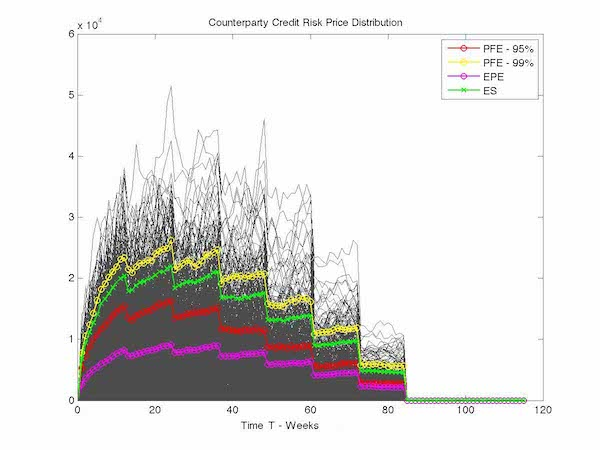

# Counterparty credit risk under credit risk contagion using time-homogeneous phase-type distribution

This repository contains two pieces of information 

* in folder `/matrix_calculation`: **block matrix determinant** calculation for a class of Markov jump processes undergoing regime shifts in their intensity 
matrix **Q** using the [Schur complement decomposition](https://en.wikipedia.org/wiki/Schur_complement)
* in folder `/phd_report`: the main body of the thesis [Counterparty credit risk under credit risk contagion using time-homogeneous phase-type distribution](https://spiral.imperial.ac.uk/handle/10044/1/33778)

## Description of the thesis content

With the situation of credit spread contagion illustrated by the European sovereign bonds crisis and the chain 
reaction triggered by the derivatives books of Lehman Brothers, financial institutions have increasingly focused on 
pricing and risk management of **counterparty credit risk**. Recent **credit contagion** through financial contingent claims
 highlight the fact that contagion links impact the value of products when investors are exposed to counterparty risk. 
 
 
 The thesis plans to build on reduced-form credit risk models to assess the credit risk contagion that is inherent 
 in a obligor multivariate framework. The aim is to evaluate the requirements that are necessary in generating a
 mathematical framework consistent with the valuation of financial claims, credit and non-credit related, where the 
 parties of those claims exhibit **credit risk contagion**. 
 
 By applying a multivariate framework of credit contagion to counterparty credit risk based on a **queueing theory**,
  called **phase-type distribution**, we hope to highlight the benefit of bottom-up models versus top-down ones in terms 
  of extracting information relative to dependence within an identifiable obligor set. This will be the opportunity to value a set of 
  claims under our model to show that claims that contain "credit leverage" are particularly sensible to credit risk contagion 
  and could benefit from  our developed framework to gain adequate counterparty credit risk pricing.

Comment: the document `/matrix_calculation/block_matrix_determinant.pdf` titled "Block matrix determinant calculation and its
application to regime phase-type distributions" can be applied to generic block matrix calculations under the assumptions detailled in the document. 


```
Structure:
	Readme.md
	/block_matrix
       block_matrix_determinant.pdf
    /phd_report
       Nowicki-P-2015-PhD Thesis.pdf
    /images
        CrossCurrencySwap.jpg
        CounterPartyCreditRiskTimeSerie_SPA.jpg
        CVA_Effect_Swap_15y.png 
        Example_RegimeSurvivaDistributionTimeSeries.jpg 
        Example_RegimeVsNoRegimeSurvivaDistributionTimeSeries1.jpg
        KTDCVAContagion.png 
        Swap_Payer.jpg 
```

## Graphical output:

### Illustration of Counterparty Credit Risk metrics for interest-rate based derivatives

Cross-currency Swap:


Receiver Interest Rate Swap:



Payer Interest Rate Swap:


with the following metrics definitions:
* PFE - 95%: Potential Future exposure is the maximum expected credit exposure over a specified period of time calculated 
at some level of confidence (95% confidence interval)  
* PFE - 99%: Potential Future Exposure -(99% confidence interval)
* EPE: Expected Positive Exposure is the expected (average) credit exposure on a future target date conditional on positive market values
* ENE: Expected Negative Exposure  is the expected (average) credit exposure on a future target date conditional on negative market values
* ES: Expected Shortfall is a risk measure—a concept used in the field of financial risk measurement to evaluate the market risk or credit 
risk of a portfolio. The "expected shortfall at 5% level" is the expected return on the portfolio in the worst 5% of cases. 
ES is an alternative to value at risk that is more sensitive to the shape of the tail of the loss distribution.


### Illustration of Counterparty Credit Risk metrics under credit risk contagion

The Credit Valuation Adjustment (CVA) is the price that an investor would pay to hedge the counterparty credit risk 
of a derivative instrument. This price depends on counterparty credit spreads as well as on the market risk factors that
 drive derivatives' values and, therefore, exposure. 
 
We will now present the **thesis results** related to credit spread contagion for a multi-obligor environment.
 
#### Illustration of Survival Distribution for different obligors

Survival Distribution with no incremental risk induced by credit contagion:
 
 
 Survival Distribution with risk induced by credit contagion captured by regime-shift:


#### Impact of credit contagion on Credit Valuation Adjustment

Credit Valuation Adjustment on Interest-Rate Swap:


Credit Valuation Adjustment on Kth-to-default Credit Default Swap:


Note: As expected credit default swap that embedded credit leverage  is very sensitive
to credit risk contagion while derivatives that are coupons-based payment have low notional exposure to contagion. 
2nd-to-default CDS and above are on the other hand very sensitive to credit risk contagion. 
